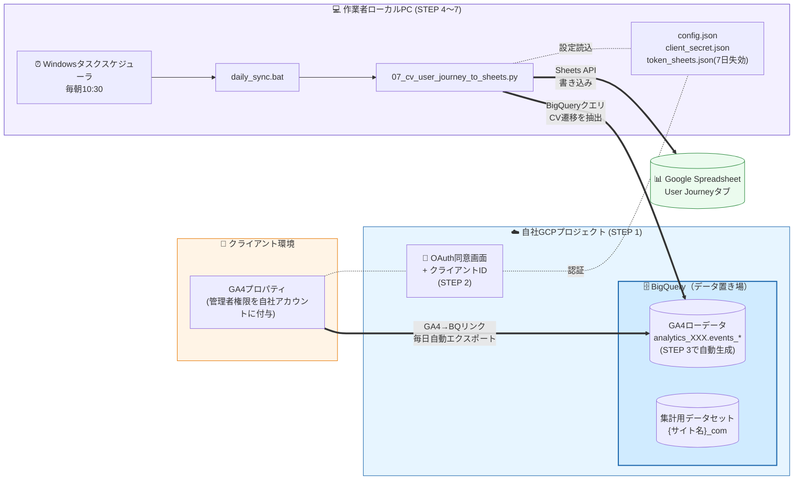
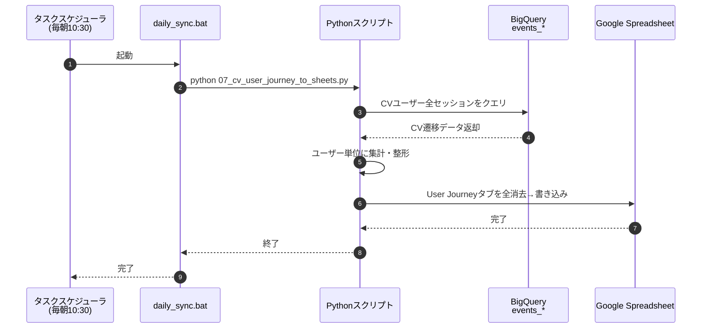
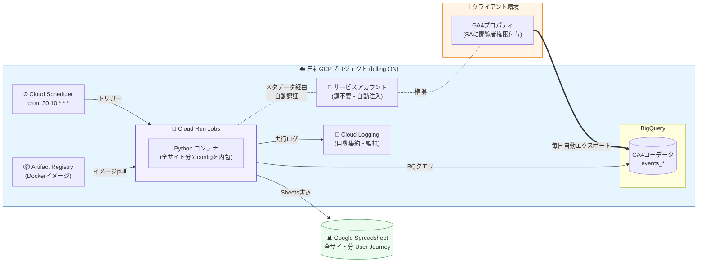
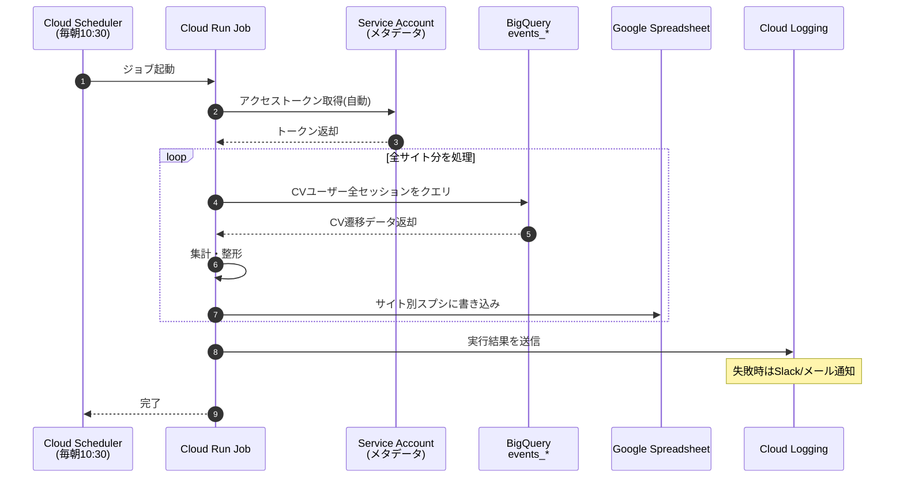
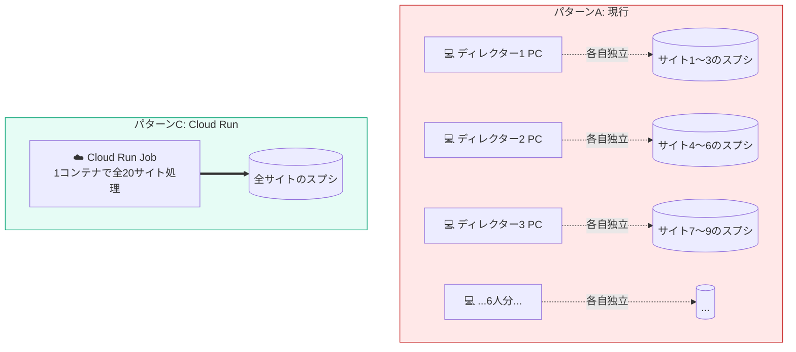
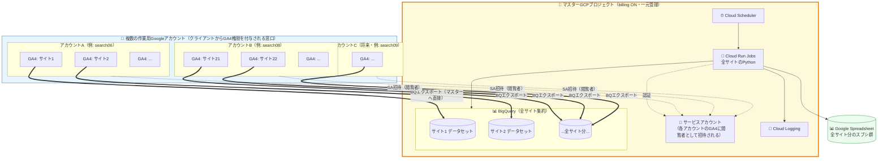
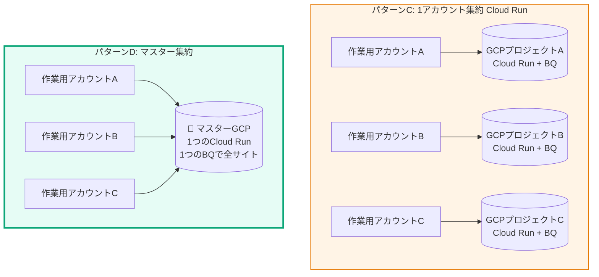
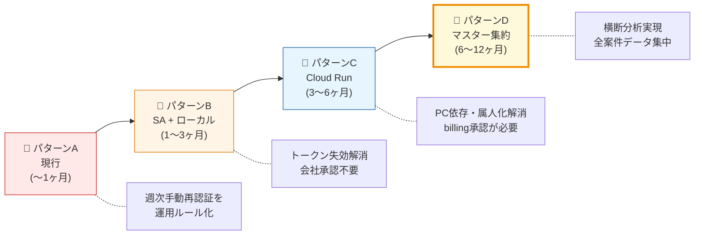

# SEOダッシュボード 汎用構築ガイド

GA4のデータをBigQuery経由でGoogle Spreadsheetに自動反映する仕組みの構築手順。
任意のサイトに転用可能。

---

> **本ガイドは パターンA（OAuth + ローカル実行）を前提に STEP 1〜7 を記載する。** 現状の運用課題、他パターンとの比較、無料枠圧迫の試算、改善方法は末尾の「現状の運用と課題」セクションにまとめている。

---

## はじめに：テンプレートの取得

テンプレートファイル一式をGitHubからダウンロードする。2通りの方法がある。

### 方法A：zipでダウンロード（Git不要・簡単）

1. ブラウザで以下のURLを開く
   https://github.com/itakura-t-hue/claude
2. 緑色の「Code」ボタンをクリック
3. 「Download ZIP」をクリック
4. ダウンロードしたzipを解凍する
5. 解凍したフォルダ内の `tools/seo-dashboard/template/` の中身をまるごとコピー
6. 任意の場所にフォルダを作り、コピーした中身をそこに貼り付ける

例：`C:\tools\min_example.com\` に配置

### 方法B：gitコマンドでclone（Gitが使える人向け）

コマンドプロンプトまたはPowerShellを開いて以下を実行：

```bash
# 1. リポジトリをダウンロード
git clone https://github.com/itakura-t-hue/claude.git

# 2. テンプレートをコピー（例：C:\tools\min_example.com に配置する場合）
xcopy /E /I claude\tools\seo-dashboard\template C:\tools\min_example.com
```

> `git clone` は「GitHubからファイルをダウンロードするコマンド」です。初回だけ実行すればOK。

### 配置後のフォルダ構成

```
{配置先フォルダ}/
├── 07_cv_user_journey_to_sheets.py  ← メインスクリプト
├── daily_sync.ps1                   ← 定期実行用
├── config_sample.json               ← 設定ファイルのひな形
├── requirements.txt                 ← Python依存パッケージ
└── .gitignore
```

> **重要：配置先のフォルダパスは英数字のみにすること。** 日本語が含まれると定期実行（タスクスケジューラ）が動かない。

以降のSTEPはこのフォルダ内で作業する。

---

## 全体像

STEP 1〜7 を完遂すると、以下のシステムが構築される。

### システム構成図



> **図の見方**: BigQuery は GCP プロジェクト内の「データ置き場」サービス。STEP 3 で設定する GA4 → BQ リンクによって、GA4のローデータが BigQuery 内の `events_*` テーブルに毎日自動で流れ込む。Pythonスクリプトはその BigQuery にクエリを投げて CV 遷移を抽出し、Sheets API で Google Spreadsheet に書き込む。

### 各STEPで作られるもの

| STEP | 作るもの | 役割 |
|------|---------|------|
| STEP 1 | GCPプロジェクト + BQデータセット | データの置き場所 |
| STEP 2 | OAuth同意画面 + クライアントID + トークン | 認証の仕組み |
| STEP 3 | GA4→BQリンク | ローデータ自動蓄積の開通 |
| STEP 4 | config.json | サイト固有の設定 |
| STEP 5 | CVイベント名の書き換え | サイト固有のCV定義 |
| STEP 6 | 初回手動実行 | 動作確認 + スプシ自動生成 |
| STEP 7 | タスクスケジューラ登録 | 毎日自動実行 |

### 日次実行の流れ（タスクスケジューラ起動後）



### スプレッドシートに蓄積されるデータ

| タブ名          | 内容                | 更新方式     |
| ------------ | ----------------- | -------- |
| User Journey | CVユーザーの全セッション遷移経路 | 毎日フルリビルド |

> **注**: GA4→BQエクスポート（STEP 3）を設定した翌日から `events_YYYYMMDD` テーブルが毎日自動生成される。Pythonスクリプトはこのローデータを毎日読み込んで集計するだけなので、スクリプトは「参照」のみで、データの一次蓄積はGA4が行う。

---

## 前提条件

### 運用体制

自社はSEOコンサルティング企業。クライアント企業のGA4データは、クライアント側から権限を共有してもらう形で取得する。GCPプロジェクトやBigQueryは自社側で用意・管理する。

### クライアントに依頼する権限共有

| 項目 | 依頼内容 | 共有先 |
|------|---------|--------|
| Google Analytics 4 | 対象プロパティの**管理者**権限を付与 | 自社の作業用Googleアカウント |

> **GA4は管理者権限が必須。** GA4→BQエクスポート（CV遷移分析に必要）の設定は自社側で行うが、この設定にはGA4の管理者権限がないとできない。閲覧者権限だけではBQエクスポートの設定画面にアクセスできない。

> **依頼テンプレート**: 「SEOレポート用のデータ連携のため、以下のGoogleアカウントにGA4の管理者権限を付与してください: `{自社作業用アカウント}@gmail.com`」

### 自社側で必要なもの

| 項目 | 要件 |
|------|------|
| Googleアカウント | クライアントからGA4の権限を共有される作業用アカウント |
| Google Cloud Platform | 自社のGCPプロジェクト（**編集者**以上） |
| OS | Windows 10/11 |
| Python | 3.10以上 |
| ネットワーク | Google APIへのアクセスが可能であること |

### 事前に確認すべきこと（クライアントに確認）

- [ ] GA4のプロパティID（GA4管理画面 → プロパティ設定 → プロパティIDで確認。`properties/XXXXXXXXX` 形式）
- [ ] CVとして計測するGA4イベント名（例: `purchase`, `form_submit` など。サイトごとに異なる）
- [ ] GA4の管理者権限の付与

### 自社側で決めること

- [ ] BQデータセットのロケーション（日本サイトなら `asia-northeast1` 推奨）
- [ ] GCPプロジェクトをクライアントごとに分けるか、1プロジェクトに複数データセットで管理するか

---

## STEP 1: GCPプロジェクトの準備

### 1.1 プロジェクト作成

1. [GCP Console](https://console.cloud.google.com/) にアクセス
2. 「プロジェクトを選択」→「新しいプロジェクト」
3. プロジェクト名を入力（例: `seo-dashboard-{サイト名}`）

> **命名規則の推奨**: プロジェクトIDは後から変更できないので、`seo-{クライアント名}` や `bq-{ドメイン名}` など分かりやすい名前にする。

### 1.2 APIの有効化

GCP Console →「APIとサービス」→「ライブラリ」で以下を検索して有効化：

- **BigQuery API**
- **Google Analytics Data API**（正式名: Google Analytics Data API (GA4)）
- **Google Sheets API**（スプレッドシートへのデータ蓄積に必要）

### 1.3 BigQueryデータセットの作成

1. [BigQuery Console](https://console.cloud.google.com/bigquery) を開く
2. 左ペインでプロジェクトを展開 →「データセットを作成」
3. 設定:
   - データセットID: 任意（例: `{サイト名}` をアンダースコア区切りで。`example_com` など）
   - ロケーション: `asia-northeast1`（東京）推奨
   - テーブルの有効期限: デフォルトのまま

GA4→BQエクスポート（STEP 3）を設定すると、`analytics_{プロパティID}.events_YYYYMMDD` テーブルが自動作成される。手動でのテーブル作成は不要。

### BQ課金について

| モード | 特徴 |
|--------|------|
| サンドボックス（請求先なし） | 完全無料。ただしDELETE不可、テーブル60日で自動削除 |
| 請求先あり | DELETE可能、データ永続。ストレージ月数十円〜、クエリ1TB/月まで無料 |

サンドボックスで運用する場合は、スクリプト実行時に常に `--skip-delete` を付ける。
長期データはスプシ側に蓄積して保持する設計になっている。

---

## STEP 2: OAuth認証の設定

### 2.1 OAuth同意画面の設定（プロジェクトで初回のみ）

1. GCP Console →「APIとサービス」→「OAuth同意画面」
2. ユーザータイプ:
   - **内部**: Google Workspace（自社ドメイン）のユーザーのみ利用可能。審査不要
   - **外部**: 誰でも利用可能。テストモードなら審査不要だが、テストユーザーの追加が必要
3. アプリ名・サポートメール等を入力
4. スコープを追加:
   - `https://www.googleapis.com/auth/analytics.readonly`
   - `https://www.googleapis.com/auth/bigquery`
   - `https://www.googleapis.com/auth/spreadsheets`

> **外部ユーザータイプの場合**: 「テストユーザー」に実行者のGoogleアカウントを追加する必要がある。追加しないと認証時にエラーになる。

### 2.2 OAuthクライアントIDの作成

1. 「APIとサービス」→「認証情報」→「認証情報を作成」→「OAuthクライアントID」
2. アプリケーションの種類: **デスクトップアプリ**
3. 名前: 任意（例: `seo-dashboard`）
4. 作成後、JSONファイルをダウンロード
5. `client_secret.json` にリネームしてスクリプトフォルダに配置

### 2.3 Python依存パッケージのインストール

以下の内容で `requirements.txt` を作成し、`pip install -r requirements.txt` を実行する。

```txt
google-api-python-client==2.149.0
google-auth-httplib2==0.2.0
google-auth-oauthlib==1.2.1
google-cloud-bigquery==3.27.0
google-analytics-data==0.18.14
```

### 2.4 トークンの発行

```bash
python 07_cv_user_journey_to_sheets.py --auth-only  # → token_sheets.json（BQ + Sheets用）
```

ブラウザが開くのでGoogleアカウント（クライアントからGA4管理者権限を付与されたアカウント）で認証する。
認証完了後、トークンファイルが自動生成される。

> **トークンの有効期限**: トークンにはリフレッシュトークンが含まれているため、通常は自動更新される。ただしGCPの同意画面が「テスト」モードの場合、7日で期限切れになる。期限切れしたらトークンファイルを削除して再度 `--auth-only` を実行する。

---

## STEP 3: GA4 → BigQueryエクスポート設定

GA4のローデータ（イベント単位）をBQに自動蓄積する設定。
CV遷移経路の分析に必要。

**この設定は自社側で行う。** クライアントからGA4の管理者権限をもらった上で実施する。

1. GA4管理画面 → 管理 → BigQueryのリンク
2. 「リンク」→ 自社のBigQueryプロジェクトを選択
3. データのロケーション: BQデータセットと同じリージョンを選択
4. エクスポート頻度: 「毎日」を選択
5. 翌日から `analytics_{プロパティID}.events_YYYYMMDD` テーブルが毎日自動蓄積される

> **GA4の管理者権限がないとこの画面にアクセスできない。** CVジャーニー分析を行う案件では、クライアントへの権限依頼時に必ずGA4管理者権限を含めること。

---

## STEP 4: config.json の作成

`config_sample.json` をコピーして `config.json` を作成し、対象サイトの情報を記入する。

```json
{
  "gcp_project_id": "{GCPプロジェクトID}",
  "bigquery_dataset": "{BQデータセット名}",
  "bigquery_location": "asia-northeast1",
  "ga4": {
    "property_id": "properties/{GA4プロパティID}",
    "oauth_client_secret_path": "./client_secret.json",
    "oauth_token_path": "./token_sheets.json"
  }
}
```

| 項目 | 説明 | 例 |
|------|------|-----|
| gcp_project_id | GCPプロジェクトID | `seo-dashboard-example` |
| bigquery_dataset | BQデータセット名 | `example_com` |
| bigquery_location | BQリージョン | `asia-northeast1` |
| ga4.property_id | GA4プロパティID | `properties/123456789` |

> `cv_journey_sheet_id` はスクリプト初回実行時にスプレッドシートが自動作成され、IDが自動追記される。

---

## STEP 5: CVイベントの設定（サイトごとにカスタマイズ必須）

CVイベント名はサイトごとに異なる。付録のソースコード内で `電話タップ` `お問い合わせフォーム` となっている箇所を、対象サイトのCVイベント名にすべて書き換える。

書き換え対象は以下の3箇所：

1. **`CV_EVENTS` 定数** — Pythonの定数定義
2. **SQL内の `WHERE event_name IN (...)`** — 1つ目（`page_view` と並んでいる箇所）
3. **SQL内の `WHERE event_name IN (...)`** — 2つ目（CVイベントのみの箇所）

> **CVイベント名の確認方法**: GA4 → レポート → エンゲージメント → イベント で実際に計測されているイベント名を確認する。

---

## STEP 6: 動作確認

```bash
python 07_cv_user_journey_to_sheets.py
```

「書き込み完了」が表示されれば成功。スプレッドシートが自動作成され、`config.json` に `cv_journey_sheet_id` が追記される。

### よくあるエラーと対処

| エラー | 原因 | 対処 |
|--------|------|------|
| `AccessDenied: Access Denied` | GA4の権限不足 | クライアントにGA4管理者権限の付与を依頼 |
| `invalid_grant` | トークン期限切れ | トークンファイルを削除して `--auth-only` で再認証 |
| `Not found: Dataset` | GA4→BQエクスポートが未設定 or データセット名の不一致 | STEP 3を確認 |
| `access_denied: app not verified` | OAuth同意画面のテストユーザー未追加 | テストユーザーに自分のアカウントを追加 |

---

## STEP 7: 定期実行の設定

### 対象スクリプト

| スクリプト | 処理内容 |
|-----------|---------|
| 07_cv_user_journey_to_sheets.py | CVユーザーの遷移経路をスプシに書き込み（毎回フルリビルド） |

### daily_sync.ps1 の修正

新しいサイト用にコピーした場合、`daily_sync.ps1` 内のPythonパスを環境に合わせて修正する。

```powershell
# Pythonの実行ファイルパス
$PYTHON = "C:\Users\{ユーザー名}\AppData\Local\Programs\Python\Python312\python.exe"
```

### タスクスケジューラへの登録

```powershell
$action = New-ScheduledTaskAction -Execute 'powershell.exe' -Argument '-ExecutionPolicy Bypass -File daily_sync.ps1' -WorkingDirectory '{スクリプトフォルダの絶対パス}'
$trigger = New-ScheduledTaskTrigger -Daily -At '10:00'
Register-ScheduledTask -TaskName '{タスク名}' -Action $action -Trigger $trigger -Description '{説明}'
```

| 項目 | 設定 |
|------|------|
| タスク名 | 例: `{サイト名}_daily_sync` |
| 実行時刻 | PCが起動している時間帯を指定 |
| 条件 | ログオン時のみ（PCスリープ中は実行されない） |

### 登録後の確認

```powershell
# 手動で1回実行してテスト
Start-ScheduledTask -TaskName '{タスク名}'

# 完了後にログを確認
Get-Content '{スクリプトフォルダ}\logs\daily_sync.log'
```

ログファイルが生成され、各スクリプトの実行結果が記録されていればOK。

---

## 新しいサイトを追加する手順（まとめ）

1. `min_dym.asia` フォルダをコピーして `min_{新サイト名}` にリネーム
2. トークンファイルを削除（`token_sheets.json`）
3. `config.json` を新サイトの情報に書き換え（STEP 4参照）
4. CVイベント名を書き換え（STEP 5参照）
5. `--auth-only` でトークンを発行（STEP 2.4参照）
6. 動作確認（STEP 6参照）
7. タスクスケジューラに登録（STEP 7参照）

> **GCPプロジェクト**: サイトごとに分けても、1プロジェクトに複数データセットを作っても可。管理しやすい方を選ぶ。

---

## 注意事項

| 項目 | 内容 |
|------|------|
| スクリプト配置パス | **英数字のみ**。日本語パスはbat/ps1で文字化けして動作しない |
| BQサンドボックス | 請求先は設定しない。データは60日で自動削除されるが、CVジャーニーはスプシに蓄積されるので問題なし |
| トークン期限切れ | OAuth同意画面が「テスト」モードだと7日で切れる。本番公開すると長期有効になるが審査が必要 |
| PC電源 | タスクスケジューラの実行時刻にPCが起動・ログイン済みでないと実行されない |
| スプシの行数上限 | Googleスプレッドシートは1シート最大1,000万セル。CVジャーニーのデータ量ならまず問題にならない |

---

## 付録: ソースコード

このセクションのコードをそのままファイルとして保存すれば動作する。

### 07_cv_user_journey_to_sheets.py

```python
"""
CV遷移経路（ユーザー単位）→ Google Spreadsheet 同期スクリプト

GA4ローデータからCVユーザーの全セッション遷移を抽出し、
ユーザー単位の情報（初回訪問日・訪問回数・CV到達セッション番号）を付与して
スプレッドシートの「User Journey」タブに書き込む。

全日付データを横断するため、毎回フルリビルド。

Usage:
  python 07_cv_user_journey_to_sheets.py
"""

import argparse
import json
from collections import defaultdict
from datetime import datetime, timedelta
from pathlib import Path

from google.auth.transport.requests import Request
from google.cloud import bigquery
from google.oauth2.credentials import Credentials
from google_auth_oauthlib.flow import InstalledAppFlow
from googleapiclient.discovery import build

SCOPES = [
    "https://www.googleapis.com/auth/bigquery",
    "https://www.googleapis.com/auth/spreadsheets",
]

TOKEN_PATH = Path(__file__).parent / "token_sheets.json"
CV_EVENTS = ("電話タップ", "お問い合わせフォーム")  # ← サイトごとに書き換え
TAB_NAME = "User Journey"


def load_config():
    config_path = Path(__file__).parent / "config.json"
    if not config_path.exists():
        config_path = Path(__file__).parent / "config_sample.json"
    with open(config_path, encoding="utf-8") as f:
        return json.load(f)


def get_credentials(config):
    creds = None
    if TOKEN_PATH.exists():
        creds = Credentials.from_authorized_user_file(str(TOKEN_PATH), SCOPES)
    if not creds or not creds.valid:
        if creds and creds.expired and creds.refresh_token:
            creds.refresh(Request())
        else:
            flow = InstalledAppFlow.from_client_secrets_file(
                config["gsc"]["oauth_client_secret_path"], SCOPES
            )
            creds = flow.run_local_server(port=0)
        with open(TOKEN_PATH, "w") as f:
            f.write(creds.to_json())
    return creds


def fetch_cv_user_journeys(bq_client, dataset_id):
    """CVしたユーザーの全セッション・全ステップを取得"""
    query = f"""
    WITH all_events AS (
      SELECT
        user_pseudo_id,
        (SELECT value.int_value FROM UNNEST(event_params) WHERE key = 'ga_session_id') AS session_id,
        event_date,
        event_timestamp,
        event_name,
        REGEXP_REPLACE(
          (SELECT value.string_value FROM UNNEST(event_params) WHERE key = 'page_location'),
          r'\\?.*', ''
        ) AS page_url
      FROM `{bq_client.project}.{dataset_id}.events_*`
      WHERE event_name IN ('page_view', '電話タップ', 'お問い合わせフォーム')
    ),
    session_source AS (
      SELECT
        user_pseudo_id,
        (SELECT value.int_value FROM UNNEST(event_params) WHERE key = 'ga_session_id') AS session_id,
        IFNULL(collected_traffic_source.manual_source, traffic_source.source) AS source,
        IFNULL(collected_traffic_source.manual_medium, traffic_source.medium) AS medium
      FROM `{bq_client.project}.{dataset_id}.events_*`
      WHERE event_name = 'session_start'
    ),
    cv_users AS (
      SELECT DISTINCT user_pseudo_id
      FROM all_events
      WHERE event_name IN ('電話タップ', 'お問い合わせフォーム')
    )
    SELECT
      ae.user_pseudo_id,
      ae.session_id,
      ae.event_date,
      ae.event_timestamp,
      ae.event_name,
      ae.page_url,
      IFNULL(ss.source, '(direct)') AS source,
      IFNULL(ss.medium, '(none)') AS medium
    FROM all_events ae
    INNER JOIN cv_users cu
      ON ae.user_pseudo_id = cu.user_pseudo_id
    LEFT JOIN session_source ss
      ON ae.user_pseudo_id = ss.user_pseudo_id
      AND ae.session_id = ss.session_id
    ORDER BY ae.user_pseudo_id, ae.event_timestamp
    """
    result = bq_client.query(query).result()
    rows = [dict(row) for row in result]
    print(f"  {len(rows)}行取得（CVユーザーの全イベント）")
    return rows


def build_user_journeys(rows):
    """生データをユーザー > セッション > ステップの構造に変換"""
    users = defaultdict(lambda: defaultdict(lambda: {
        "events": [],
        "source": "(direct)",
        "medium": "(none)",
        "date": "",
        "has_cv": False,
        "cv_event": None,
    }))

    for row in rows:
        uid = row["user_pseudo_id"]
        sid = row["session_id"]
        session = users[uid][sid]
        session["events"].append({
            "event_name": row["event_name"],
            "page_url": row["page_url"],
            "event_timestamp": row["event_timestamp"],
        })
        session["source"] = row["source"]
        session["medium"] = row["medium"]
        ed = row["event_date"]
        session["date"] = f"{ed[:4]}-{ed[4:6]}-{ed[6:8]}"
        if row["event_name"] in CV_EVENTS:
            session["has_cv"] = True
            session["cv_event"] = row["event_name"]

    return users


def pivot_user_journeys(users):
    """ユーザー単位のデータを横展開レコードに変換"""
    all_records = []
    max_steps = 0

    for uid, sessions in users.items():
        sorted_sessions = sorted(
            sessions.items(),
            key=lambda x: min(e["event_timestamp"] for e in x[1]["events"])
        )

        total_sessions = len(sorted_sessions)

        first_session = sorted_sessions[0][1]
        first_events = sorted(first_session["events"], key=lambda e: e["event_timestamp"])
        first_visit_date = first_session["date"]
        first_visit_page = ""
        for e in first_events:
            if e["event_name"] == "page_view":
                first_visit_page = e["page_url"]
                break

        for session_idx, (sid, session) in enumerate(sorted_sessions):
            session_no = session_idx + 1
            events = sorted(session["events"], key=lambda e: e["event_timestamp"])

            steps = []
            cv_event = ""
            for e in events:
                if e["event_name"] in CV_EVENTS:
                    steps.append(f"【CV】{e['event_name']}")
                    cv_event = e["event_name"]
                else:
                    steps.append(e["page_url"])

            total_steps = len(steps)
            if total_steps > max_steps:
                max_steps = total_steps

            record = [
                session["date"],
                uid,
                first_visit_date,
                first_visit_page,
                total_sessions,
                session_no,
                "○" if session["has_cv"] else "",
                cv_event,
                session["source"],
                session["medium"],
                total_steps,
            ] + steps

            all_records.append(record)

    fixed_cols = [
        "date", "user_pseudo_id", "first_visit_date", "first_visit_page",
        "total_sessions", "session_no", "is_cv", "cv_event",
        "source", "medium", "total_steps",
    ]
    header = fixed_cols + [f"step{i}" for i in range(1, max_steps + 1)]

    return header, all_records, max_steps


def col_index_to_letter(index):
    result = ""
    while index >= 0:
        result = chr(ord("A") + index % 26) + result
        index = index // 26 - 1
    return result


def ensure_tab_exists(sheets_service, spreadsheet_id):
    """User Journeyタブがなければ作成"""
    spreadsheet = sheets_service.spreadsheets().get(spreadsheetId=spreadsheet_id).execute()
    tabs = [s["properties"]["title"] for s in spreadsheet["sheets"]]
    if TAB_NAME not in tabs:
        sheets_service.spreadsheets().batchUpdate(
            spreadsheetId=spreadsheet_id,
            body={"requests": [{"addSheet": {"properties": {"title": TAB_NAME}}}]},
        ).execute()
        print(f"  「{TAB_NAME}」タブを作成しました")


def expand_sheet_columns(sheets_service, spreadsheet_id, needed_columns):
    """シートの列数を必要数まで拡張"""
    spreadsheet = sheets_service.spreadsheets().get(spreadsheetId=spreadsheet_id).execute()
    for sheet in spreadsheet["sheets"]:
        if sheet["properties"]["title"] == TAB_NAME:
            current_cols = sheet["properties"]["gridProperties"]["columnCount"]
            sheet_id_num = sheet["properties"]["sheetId"]
            break
    else:
        return

    if current_cols >= needed_columns:
        return

    sheets_service.spreadsheets().batchUpdate(
        spreadsheetId=spreadsheet_id,
        body={"requests": [{
            "appendDimension": {
                "sheetId": sheet_id_num,
                "dimension": "COLUMNS",
                "length": needed_columns - current_cols,
            }
        }]},
    ).execute()
    print(f"  シート列数を {current_cols} → {needed_columns} に拡張")


def write_to_sheet(sheets_service, spreadsheet_id, header, records):
    """タブをクリアしてヘッダー + データを書き込み"""
    sheets_service.spreadsheets().values().clear(
        spreadsheetId=spreadsheet_id,
        range=TAB_NAME,
    ).execute()

    body = {"values": [header] + records}
    sheets_service.spreadsheets().values().update(
        spreadsheetId=spreadsheet_id,
        range=f"{TAB_NAME}!A1",
        valueInputOption="RAW",
        body=body,
    ).execute()
    print(f"  {len(records)}行 書き込み完了")


def main():
    parser = argparse.ArgumentParser(description="CV遷移経路（ユーザー単位）→ Google Sheets 同期")
    parser.add_argument("--auth-only", action="store_true", help="認証のみ実行")
    args = parser.parse_args()

    config = load_config()
    creds = get_credentials(config)

    if args.auth_only:
        print("認証完了。")
        return

    print("=== CV遷移経路（ユーザー単位）→ Google Sheets 同期 ===")

    bq_client = bigquery.Client(
        project=config["gcp_project_id"],
        credentials=creds,
        location=config["bigquery_location"],
    )
    sheets_service = build("sheets", "v4", credentials=creds)

    spreadsheet_id = config.get("cv_journey_sheet_id")
    if not spreadsheet_id:
        print("[ERROR] cv_journey_sheet_id が config.json にありません。")
        return

    print("\n[1/3] スプレッドシート準備...")
    ensure_tab_exists(sheets_service, spreadsheet_id)

    print("\n[2/3] BigQueryからCVユーザーの全セッションデータ取得中...")
    ga4_dataset = f"analytics_{config['ga4']['property_id'].replace('properties/', '')}"
    rows = fetch_cv_user_journeys(bq_client, ga4_dataset)

    if not rows:
        print("  CVデータがありません。")
        return

    users = build_user_journeys(rows)
    header, records, max_steps = pivot_user_journeys(users)
    print(f"  CVユーザー数: {len(users)}人")
    print(f"  総セッション数: {len(records)}行")
    print(f"  最大ステップ数: {max_steps}")

    print("\n[3/3] スプレッドシートに書き込み中...")
    needed_columns = len(header)
    expand_sheet_columns(sheets_service, spreadsheet_id, needed_columns)
    write_to_sheet(sheets_service, spreadsheet_id, header, records)

    print(f"\n=== 完了 ===")
    print(f"スプレッドシート: https://docs.google.com/spreadsheets/d/{spreadsheet_id}")


if __name__ == "__main__":
    main()
```

> **書き換え必須箇所**: `CV_EVENTS` とSQL内の `WHERE event_name IN (...)` をサイトのCVイベント名に変更する（STEP 5参照）。

### daily_sync.ps1

```powershell
# 日次同期スクリプト（タスクスケジューラから毎日実行）

$ErrorActionPreference = "Continue"
$env:PYTHONIOENCODING = "utf-8"
$PYTHON = "C:\Users\{ユーザー名}\AppData\Local\Programs\Python\Python312\python.exe"  # ← 環境に合わせて修正
$SCRIPT_DIR = $PSScriptRoot
$LOG_DIR = Join-Path $SCRIPT_DIR "logs"
$LOG_FILE = Join-Path $LOG_DIR "daily_sync.log"

if (-not (Test-Path $LOG_DIR)) { New-Item -ItemType Directory -Path $LOG_DIR | Out-Null }

function Add-Log($message) {
    $timestamp = Get-Date -Format "yyyy-MM-dd HH:mm:ss"
    $line = "[$timestamp] $message"
    Add-Content -Path $LOG_FILE -Value $line -Encoding UTF8
}

Set-Location $SCRIPT_DIR

Add-Log "=== daily sync start ==="

Add-Log "CV user journey start"
$out = & $PYTHON "07_cv_user_journey_to_sheets.py" 2>&1 | Out-String
Add-Content -Path $LOG_FILE -Value $out -Encoding UTF8

Add-Log "=== daily sync complete ==="
Add-Content -Path $LOG_FILE -Value "" -Encoding UTF8
```

### フォルダ構成

上記のファイルを以下の構成で配置する：

```
{サイト名}/
├── 07_cv_user_journey_to_sheets.py  ← 付録からコピー
├── daily_sync.ps1                   ← 付録からコピー
├── config.json                      ← STEP 4で作成
├── client_secret.json               ← STEP 2.2でGCPからダウンロード
├── requirements.txt                 ← STEP 2.3で作成
└── logs/                            ← 自動生成
```

---

## 付録: パターンB（サービスアカウント）への移行

パターンAで動作確認が済んだ後、トークン失効問題を解消するための移行手順。
BQ billing は OFF のまま運用可能。

### B-1. サービスアカウントの作成

1. GCP Console →「IAMと管理」→「サービスアカウント」→「サービスアカウントを作成」
2. 名前: 任意（例: `seo-dashboard-bot`）
3. ロールを付与:
   - BigQuery データ編集者
   - BigQuery ジョブユーザー
4. 作成後、サービスアカウントの「キー」タブ →「鍵を追加」→「新しい鍵」→ JSON形式でダウンロード
5. ダウンロードした `xxx.json` を `service_account.json` にリネームしてスクリプトフォルダに配置
6. **`.gitignore` に `service_account.json` を追加**（漏洩防止）

### B-2. 各サービスへのサービスアカウント招待

作成したサービスアカウントのメアド（例: `seo-dashboard-bot@{プロジェクトID}.iam.gserviceaccount.com`）を以下に追加：

| 対象 | 権限 | 追加場所 |
|------|------|---------|
| GA4プロパティ | 閲覧者 | GA4管理画面 → プロパティアクセス管理 |
| GSC（使う場合） | 所有者またはフルユーザー | GSC → 設定 → ユーザーと権限 |
| スプレッドシート | 編集者 | スプシの「共有」 |

> **GSCはクライアント管理の場合**: クライアント側の担当者に追加依頼が必要。権限付与の窓口がクライアント側にある案件では、依頼テンプレートを用意して運用に組み込む。

### B-3. スクリプトの書き換え

`07_cv_user_journey_to_sheets.py` の `get_credentials` 関数を以下に置き換える：

```python
from google.oauth2 import service_account

SERVICE_ACCOUNT_PATH = Path(__file__).parent / "service_account.json"

def get_credentials(config):
    return service_account.Credentials.from_service_account_file(
        str(SERVICE_ACCOUNT_PATH),
        scopes=SCOPES,
    )
```

`--auth-only` フラグは不要になるため、関連コードは削除してよい。

### B-4. 動作確認

```bash
python 07_cv_user_journey_to_sheets.py
```

トークンファイル（`token_sheets.json`）は使わないため削除してよい。以降は鍵ファイルがある限り永続動作する。

---

## 付録: パターンC（Cloud Run）への移行

PC依存と属人化を完全に解消するための構成。全案件を1つのCloud Run環境に集約することも可能。

### C-1. 前提条件（会社承認が必要）

- GCPプロジェクトに **請求先アカウント** を紐付ける
  - これを行うと BQ の DELETE 操作も可能になり、`--skip-delete` フラグの制約がなくなる
  - 現行の「BQ請求先を設定しない」方針との衝突のため、会社判断を要する
- 予想費用: 無料枠内で月数百円程度（Cloud Run 日1回1分実行、Cloud Scheduler 3ジョブ以内）

### C-2. 構成イメージ

#### システム構成図



#### 日次実行のシーケンス



#### パターンA との構造的な違い（可視化）



### C-3. 実装の流れ（概略）

1. スクリプトをDockerコンテナ化（`Dockerfile` 作成）
2. Artifact Registry にイメージpush
3. Cloud Run Jobs としてデプロイ
4. Cloud Scheduler でトリガー設定（cron: `30 10 * * *`）
5. ログは Cloud Logging に自動集約

### C-4. 主な差分（パターンBとの比較）

| 項目 | パターンB | パターンC |
|------|----------|----------|
| 実行場所 | ローカルPC | Cloud Run（コンテナ） |
| 鍵ファイル | `service_account.json` をローカル配置 | 不要（Cloud Runに紐付けたSAをメタデータサーバー経由で自動取得） |
| スケジューラ | Windowsタスクスケジューラ | Cloud Scheduler |
| ログ | ローカルファイル | Cloud Logging |
| 複数サイトの扱い | サイトごとにPC・認証・タスク登録 | 1リポジトリ・1コンテナで全サイト集約可 |

### C-5. 移行の推奨タイミング

- 運用案件数が10を超えた
- 担当者が頻繁に入れ替わる体制になった
- ダッシュボード更新の稼働確認に人手を割けなくなった
- このいずれかに該当したら会社承認の相談を開始する

---

## 付録: パターンD（マスターアカウント集約）

パターンCをさらに進化させ、**複数の作業用アカウントにまたがっていたGA4/BQ/スプシを、1つのマスターGCPプロジェクトに集約**する構成。最終的に目指す姿。

### D-1. 狙い

| 課題（現状・パターンB/C） | パターンDでの解決 |
|--------------------------|----------------|
| 作業用アカウントA/B/Cごとに GCPプロジェクトが分散（例: bq-search06, bq-search08, bq-search09） | **1マスタープロジェクト**に全サイトのBQデータセットを集約 |
| サイトまたぎの横断分析（全案件のCV率比較、カテゴリ別パフォーマンス等）が困難 | 1つのBQ上で全サイトを横断クエリ可能 |
| アカウントごとの権限・課金・認証情報の管理コスト | IAMベースの一元管理 |
| GCPプロジェクトが増えるたびに Cloud Run を別途デプロイ | 1つの Cloud Run 基盤で全案件を運用 |

### D-2. 構成イメージ

#### システム構成図



#### パターンC vs パターンD（構造比較）



### D-3. データ集約の仕組み

GA4 → BigQuery エクスポート機能は、**GA4プロパティの管理者権限があるアカウントが操作すれば、任意のGCPプロジェクトをエクスポート先に指定可能**。この性質を使って、全サイトのGA4エクスポート先を「マスターGCPプロジェクト」に統一する。

| 要素 | 設定内容 |
|------|---------|
| GA4 → BQ エクスポート先 | 全サイト → マスターGCPプロジェクト |
| BQ データセット命名 | `analytics_{propertyId}` または `{client_name}_{site_name}` |
| サービスアカウント | マスタープロジェクトに1つ作成。各作業用アカウントのGA4プロパティに「閲覧者」で招待 |
| Cloud Run Jobs | マスタープロジェクトに1つ。configで全サイトのpropertyIdとスプシIDを管理 |
| Cloud Scheduler | マスタープロジェクトに1つ。1 cronで全サイトを一括処理 |

### D-4. 移行手順（既存案件がある場合）

1. **マスターGCPプロジェクトを新規作成**（billing ON）
2. サービスアカウントを作成し、各作業用アカウントの GA4プロパティに閲覧者権限で招待
3. 各サイトの **GA4 → BQリンクを張り替え**（既存のbq-search06等のexport停止 → マスターへのexport新規設定）
   - 既存データは `bq cp` または Scheduled Queries でマスターへ移送
   - 新規データは当日から自動でマスターへ入る
4. Cloud Run Jobs + Cloud Scheduler をマスタープロジェクトにデプロイ
5. 旧GCPプロジェクト（bq-search06/08/09）を停止またはアーカイブ

### D-5. 移行にあたっての注意

| 項目 | 内容 |
|------|------|
| GA4 BQリンクの張り替え | **データの連続性が1日空く可能性あり**。移行日を決めて案件ごとに段階的に実施 |
| 既存データの扱い | `bq cp` でマスターに移送するか、旧プロジェクトを「アーカイブ用」として残す判断 |
| 権限の集中リスク | マスタープロジェクトへのIAM付与は最小限に。ログ/アラートで不正アクセス検知 |
| 会社承認 | パターンCと同じくbilling有効化が必要。加えて全案件データが1プロジェクトに集中することの社内説明が必要 |
| 費用 | 20サイト集約で月数百円〜1,000円程度（Cloud Run + BQ クエリ実費） |

### D-6. 移行の推奨タイミング

- パターンCを1プロジェクトで1年以上安定運用できている
- 横断分析（複数サイトのパフォーマンス比較・クライアント横断KPI集計）のニーズが出てきた
- 案件数が20を超え、GCPプロジェクト管理が煩雑になってきた
- 新規案件から順次マスターへ寄せる方針で決着がついた

---

## 現状の運用と課題

自社は全社で **約180案件** を運用しているが、1つのGoogleアカウントに権限付与できる案件数には上限がある（権限付与・APIクォータ・OAuthリフレッシュトークン上限などの観点から、実運用上は **1アカウントあたり20〜30サイトが限界**）。このため、`search06` / `search08` / `search09` などの **作業用アカウントを複数用意して、20サイト単位で分散** している。約6名のSEOディレクターがそれらのアカウントを跨いで担当し、それぞれ自身のローカルPC上でPythonスクリプトを実行してダッシュボードのデータ更新を行っている。

結果として：

- **アカウント・GCPプロジェクト・BQが分散**（search06/08/09 等、1アカウント毎に1GCPプロジェクト）
- 全社横断の分析（案件横断KPI集計、カテゴリ横断パフォーマンス比較など）が **現構造では実質不可能**
- 属人化・再現性の低さも加わり、運用としては雑すぎる状態

> **💡 パターンDの必然性**: アカウント分散は権限上限による**物理的制約**であり、運用工夫では解消できない。BQ層で集約しないと全社横断分析は永久に実現できない。最終形として「マスターGCPへのBQ集約」（パターンD）が不可避の選択となる。

### 抱えている運用上の問題

| 項目 | 内容 |
|------|------|
| PC依存 | 担当者のPCがオフ／スリープ中は更新が止まる |
| トークン失効 | OAuth同意画面が「テスト」モードのため、トークンが7日で強制失効。週1で手動再認証が必要 |
| 属人化 | 認証情報・設定値・トラブル対応ノウハウが各人のローカルに散在 |
| 引き継ぎ負荷 | 担当者変更のたびに環境構築・トークン再発行・権限付与をやり直す |
| 監視なし | 実行失敗が当日気付けない。翌朝スプシを見て初めて気付くこともある |
| アカウント分散 | 権限上限のため1アカウント20〜30サイトが限界 → 複数アカウント（search06/08/09...）に分散 → 全社横断分析が現構造では不可能 |

### 1アカウント20サイト × 毎日実行時の無料枠圧迫試算

> **試算の前提**: APIクォータは多くが「ユーザー単位」「プロジェクト単位」で効く。したがって **1アカウント（≒1 GCPプロジェクト）あたりの試算** と、**全社180案件（6〜9アカウント分散）合計** の試算を分けて計算する。

#### 1アカウント（20サイト）あたりの試算

毎朝10:30に全20サイトの daily_sync が順次実行される前提で、各APIの消費量を試算する。

#### Search Console API

- **公式クォータ**: 1,200 queries / minute / user、50 QPS / project、日次上限なし
- **実消費**: 1サイト = 1日分 × (query / page) の2次元 = **2 queries/日**
- **20サイト合計**: 40 queries / 実行 → user クォータの約3%
- **判定**: **余裕**（将来100サイト規模でも問題なし）

#### GA4 Data API

- **公式クォータ**: 200,000 tokens / property / day、40,000 tokens / property / hour
- **実消費**: 1サイト = 4クエリ（daily_summary / channel / landing_page / organic）、1クエリ数十〜数百token
- **プロパティ単位の制限**なので20サイト同時でも各プロパティは独立
- **判定**: **余裕**

#### BigQuery ストレージ

- **無料枠**: 10 GB / 月
- **実消費（GSC主体）**: 約25,000行/日 × 100byte × 20サイト = 約50 MB/日 = **1.5 GB/月**
- **1年後累計**: 約18 GB → **11〜12ヶ月目で無料枠超過**
- **超過後の課金**: 超過分 $0.02/GB/月 = 月数十円〜百円程度
- **判定**: **中期で超過。ただし金額は小さい**

#### BigQuery ストリーミング挿入

- **無料枠**: 200 MB / 月
- **実消費**: GSCインサートだけで数十 MB/日 → 月1.5 GB
- **判定**: **サンドボックスモード下で超過した場合の挙動は GCP 公式に明記されていない（要検証）**

#### Google Sheets API

- **公式クォータ**: 60 requests/minute/user、300 read/minute/project
- **実消費**: 1サイト = 書き込み数回。20サイトを10:30に一斉実行すると瞬間的に制限ヒットの可能性
- **判定**: **リスクあり**。daily_sync.bat の逐次実行（1サイトずつ）なら回避可能

#### OAuth Refresh Token

- **公式制限**: (OAuth client × user) の組み合わせで最大100トークン
- **実消費**: 20サイト = 20トークン（同一アカウント・同一OAuthクライアント想定）
- **判定**: **当面余裕、100サイト規模で枯渇懸念**

#### 1アカウント単位の試算まとめ

| 対象 | 1アカウント20サイト時点の判定 |
|------|----------------|
| GSC API | 余裕（40 queries / 実行 = user クォータの約3%） |
| GA4 Data API | 余裕（プロパティ単位なので分散効果大） |
| BQストレージ | 1年目で10GB超過（月数十円〜） |
| BQストリーミング挿入 | サンドボックス挙動要検証 |
| Sheets API | 瞬間的rate limit ヒットの可能性あり |
| OAuthトークン | 余裕（20/100） |

### 全社180案件規模の試算（6〜9アカウントに分散）

180案件 = 6アカウント × 30サイト相当（または9アカウント × 20サイト相当）の分散で運用している前提。

**アカウントが物理的に分かれているため、ユーザー単位クォータは1アカウント内に閉じて効く**。一方、BQストレージはGCPプロジェクトが分散している限りは各プロジェクトで独立。パターンD（マスター集約）に移行するとストレージ・クエリは1プロジェクトに集中するため、集中側の試算も併記する。

| 対象 | 分散構成（現状延長） | パターンD集約後 |
|------|--------------------|---------------|
| GSC API ユーザークォータ | 各アカウント独立で余裕 | アカウント跨ぎでSA集約 → 1SA集中でも余裕（約360 queries/実行 = 30%） |
| GA4 Data API | プロパティ単位なので余裕 | 同上 |
| BQストレージ（合計） | 180サイト × 2.5 MB/日 = 約**13 GB/月** → 1ヶ月で10GB無料枠超過（超過分 $0.02/GB/月 = **月数百円**） | 同じ容量が1プロジェクトに集中。月数百円〜1,000円 |
| BQ累計（1年後） | **約160 GB** → 超過分 $3/月程度 | 同上 |
| Sheets API | アカウント分散で分散 | 1SAに集中 → 180サイト一斉実行は確実にrate limit ヒット → **実行時刻分散 or 並列度制限が必須** |
| OAuthトークン | アカウント毎に20/100で余裕 | SA化で当該制約消滅（OAuthリフレッシュトークン上限は該当しない） |

**全社規模の結論**:

- **無料枠の金銭インパクトは最大でも月1,000円程度**（過剰な心配は不要）
- ただし **集約時のSheets API rate limit** は要設計（逐次実行 or 時刻分散で回避）
- パターンB/C/D への移行判断は「お金」ではなく **運用破綻リスク（PC依存・トークン失効・横断分析不能）** が決め手

**総合結論**: 無料枠自体は金額的に問題にならないが、**実質のボトルネックは運用構造（PC依存・トークン失効・属人化・アカウント分散による横断分析不能）**。金額より先に人的コストと意思決定コストで破綻する。

### 運用方式の選択（4パターン比較）

改善方向として以下4パターンがある。本ガイドのSTEP 1〜7は **パターンA** を前提にしている。最終ゴールは **パターンD**（マスターアカウントへの一元集約）。

#### 比較表

| 観点 | パターンA（現行） | パターンB | パターンC | **パターンD（最終形）** |
|------|-----------------|----------|----------|-----------------------|
| 認証方式 | OAuth（テストモード） | サービスアカウント | サービスアカウント | サービスアカウント（クロスアカウント招待） |
| 実行環境 | ローカルPC + タスクスケジューラ | ローカルPC + タスクスケジューラ | Cloud Run + Cloud Scheduler | **マスターGCP**の Cloud Run + Cloud Scheduler |
| GCPプロジェクト | 作業用アカウント別に分散 | 同上 | 同上 | **マスター1つに集約** |
| BQデータ | アカウント別・プロジェクト別に分散 | 同上 | 同上 | **マスターBQに全サイト集約** |
| 横断分析 | 不可（プロジェクト間クエリが面倒） | 不可 | 不可 | **可能（1 BQでSQL横断）** |
| BQ請求先 | OFF（サンドボックス） | OFF（サンドボックス） | **ON必須** | **ON必須** |
| トークン失効 | 7日（手動再認証） | なし | なし | なし |
| PC依存 | あり（常時起動必須） | あり（常時起動必須） | なし | なし |
| 属人化 | 高（各人PCに分散） | 中（鍵ファイル管理が必要） | 低（クラウド集約） | **最低（IAM一元管理）** |
| 実装コスト | 低（現行） | 中（スクリプト改修） | 高（コンテナ化＋デプロイ） | 高＋（既存案件の移送作業） |
| 月額費用 | 0円 | 0円 | 0円〜数百円 | 数百円〜1,000円程度 |
| 判断レベル | 現場判断OK | 現場判断OK | **会社判断**（billing） | **会社判断**（billing + 全データ集中） |

#### パターンA: OAuth + ローカル実行（現行・短期）

- **向いているケース**: PoC・短期運用・すぐ動かしたい
- **メリット**: 実装が単純、費用ゼロ
- **デメリット**: 7日ごとの手動再認証、PC依存、属人化

#### パターンB: サービスアカウント + ローカル実行（中期改善）

- **向いているケース**: 長期運用だがクラウド移行は未了
- **メリット**: トークン失効なし、鍵ファイル一元管理、BQ billing OFFのまま
- **デメリット**: 担当者PC依存は残る、鍵ファイル漏洩リスクあり
- **パターンAとの差分**: OAuth認証部分を `Credentials.from_authorized_user_file` → `service_account.Credentials.from_service_account_file` に変更、GA4/GSC/Sheetsにサービスアカウントのメアドを追加
- **詳細手順**: 付録「パターンB（サービスアカウント）への移行」参照

#### パターンC: Cloud Run + Cloud Scheduler（長期理想）

- **向いているケース**: 長期運用・複数サイトを集中管理・PC依存を排除したい
- **メリット**: PC不要、鍵ファイル不要（メタデータサーバー経由）、属人化解消、監視機能付き
- **デメリット**: **GCPプロジェクトに請求先アカウントの紐付けが必須** → 現行の「BQ請求先を設定しない」運用方針と衝突するため、会社判断が必要
- **費用**: 無料枠（200万リクエスト/月、Cloud Scheduler 3ジョブ無料）内で収まる想定。実費用は月数百円程度。
- **詳細手順**: 付録「パターンC（Cloud Run）への移行」参照

#### パターンD: マスターアカウント集約（最終ゴール）

- **向いているケース**: 複数作業用アカウント・複数GCPプロジェクトを一元化したい、横断分析を行いたい
- **メリット**:
  - 全サイトのBQが1箇所に集約 → **横断SQL分析が可能**
  - IAMベースの一元管理・監査ログ集約
  - 新規案件追加が config 追記のみで完結
- **デメリット**:
  - 既存案件のBQエクスポート先の張り替え作業が発生（データ連続性リスク）
  - マスタープロジェクトへの権限集中リスク（厳格な IAM 運用が必要）
  - billing 有効化 + 全案件データ集中の社内承認が必要
- **費用**: 月数百円〜1,000円程度（20サイト想定）
- **詳細手順**: 付録「パターンD（マスターアカウント集約）」参照

### 改善方法

| 課題 | 対応策 | 参照 |
|------|-------|------|
| トークン7日失効 | パターンB（サービスアカウント）へ移行 | 付録: パターンB |
| PC依存 | パターンC（Cloud Run）へ移行 | 付録: パターンC |
| 属人化・引き継ぎ負荷 | パターンC で全サイトをクラウド集約 | 付録: パターンC |
| 20サイト同時実行によるSheets rate limit | 実行時刻を分散（10:30/10:35/10:40...）or daily_sync を逐次実行のまま維持 | STEP 7 |
| BQストレージ超過 | テーブル有効期限60日設定（サンドボックス標準）＋長期データはスプシ側に蓄積（現行設計のまま） | STEP 1.3 |
| OAuthトークン枯渇（将来） | OAuthクライアントをサイトごとに分ける or サービスアカウント移行（パターンB/C） | 付録: パターンB |
| アカウント集中リスク | 作業用アカウントを複数に分割（案件グループ単位）／パターンC で IAM ベースに移行 | - |
| 監視なし | Cloud Logging + エラー通知（Slack/メール）をパターンC で同時導入 | 付録: パターンC |
| **横断分析できない**（プロジェクト分散） | **パターンD でマスターBQに全サイト集約し、1つのSQLで複数サイトを横断クエリ** | **付録: パターンD** |
| GCPプロジェクト管理の煩雑化 | パターンD でマスターGCP1つに統合 | 付録: パターンD |

### 優先度付き移行ロードマップ



| フェーズ | 期間目安 | 移行先 | キー判断 |
|---------|---------|-------|--------|
| 短期 | 〜1ヶ月 | パターンA（現状維持） | 週次再認証を運用ルール化 |
| 中期 | 1〜3ヶ月 | **パターンB** | トークン失効解消。スクリプト改修のみ、会社承認不要 |
| 長期 | 3〜6ヶ月 | **パターンC** | PC依存・属人化解消。billing有効化の会社承認が必要 |
| 最終 | 6〜12ヶ月 | **🌟 パターンD** | 複数アカウントのBQをマスターに一元集約。横断分析実現 |
